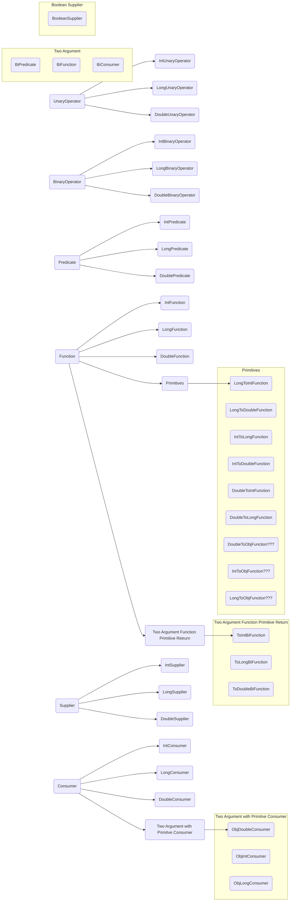

# Item 44: Favor the use of standard functional interfaces

- If one of the standard functional interfaces does the job, you should generally use 
it in preference to a purpose-built functional interface.

Interface | Function Signature | Example             |
--------- |--------------------|---------------------|
UnaryOperator<T> | T apply(T t)       | String::toLowerCase |
BinaryOperator<T> | T apply(T t1, Tt2) | BigInteger::add     |
Predicate<T> | boolean test(T t)  | Collection::isEmpty |
Function<T, R> | R apply(T t)       | Arrays::asList      |
Supplier<T> | T get()            | Instant::now        |
Consumer<T> | void accept(T t)   | System.out::println |

- Don't be tempted to use basic functional interfaces with boxed primitives instead of
primitive functional interfaces.
- You should prefer to write custom functional interface in preference to using a standard one only if
  - It will be commonly used and could benefit from a descriptive name.
  - It has a strong contract associated with it.
  - It would benefit from custom default methods.
- Always annotate your functional interfaces with the `@FunctionalInterface` annotation.
- Do not provide a method with multiple overloadings that take different functional
interfaces in the same argument position if it could create a possible ambiguity in
the client.

